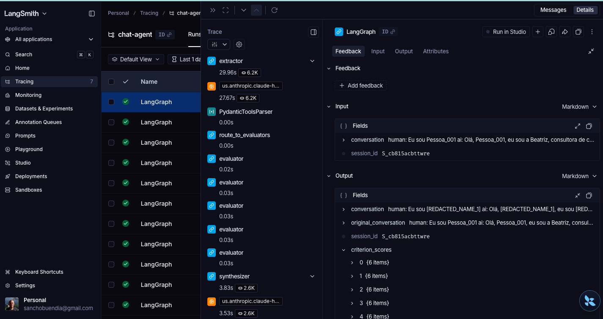

# Documento de Solucao

## Visao geral

O objetivo da solucao e apoiar a avaliacao humana da qualidade de atendimentos em canais digitais, produzindo um relatorio estruturado com scores, justificativas e evidencias. O foco do MVP e combinar interpretacao flexivel de linguagem natural com regras claras de negocio e auditoria, sem obrigar o avaliador humano a ler um JSON completo em todos os casos.

A arquitetura adotada no prototipo separa o problema em duas camadas:

- interpretacao da conversa em fatos estruturados
- avaliacao desses fatos por criterio, com rubricas versionaveis

Essa separacao evita que cada criterio dependa diretamente da conversa bruta, reduz custo, melhora rastreabilidade e facilita evolucao.

## Fluxo fim a fim

```text
Conversa recebida
  -> validacao do payload
  -> normalizacao em texto unico
  -> guardrails de seguranca
  -> extrator LLM gera ExtractedFacts
  -> roteamento para 5 criterios paralelos
  -> scoring deterministico por rubrica
  -> sintese final do EvaluationReport
  -> resumo executivo via LLM
  -> resposta da API
```

Campos relevantes do relatorio:

- score final ponderado
- classificacao final
- executive_summary
- score por criterio
- justificativa por criterio
- evidencias por criterio no modo detalhado
- fatos extraidos da conversa no modo detalhado
- pontos fortes
- areas de melhoria

## Criterios de avaliacao

O MVP usa cinco criterios com pesos explicitos:

- C1 Identificacao e compreensao da necessidade: 25%
- C2 Assertividade da resposta: 25%
- C3 Conducao e fluxo da conversa: 20%
- C4 Conformidade com regras de negocio: 20%
- C5 Desfecho e encaminhamento: 10%

Os criterios foram escolhidos para equilibrar experiencia do cliente, aderencia operacional e capacidade de coaching do operador.

## Estrategia de prompts

O prototipo usa prompt no extrator e no sintetizador executivo. A decisao foi deliberada.

Principios:

- extrair fatos observaveis e nao julgamentos
- ser conservador em caso de ambiguidade
- preservar evidencias textuais no output estruturado
- produzir schema fixo para alimentar scoring deterministico
- gerar um resumo executivo curto e ancorado apenas no relatorio estruturado

Trade-off:

- vantagem: menos variabilidade nos scores e maior auditabilidade
- desvantagem: parte da inteligencia analitica fica concentrada na cobertura do schema de extracao

Evolucao natural:

- versionar prompts por `prompt_version`
- armazenar prompt, modelo e resposta bruta por execucao
- introduzir prompts por criterio somente onde heuristica ficar insuficiente

## Estrategia de modelos

### MVP adotado

- um unico modelo para extracao estruturada
- scoring deterministico
- um segundo uso de LLM apenas para o resumo executivo

Racional:

- menor custo por conversa
- menor latencia que uma arquitetura totalmente LLM
- maior consistencia entre execucoes
- mais facilidade de justificar a nota para auditoria humana
- melhor usabilidade para o avaliador com uma resposta curta por padrao

### Criterios para escolha do modelo do extrator

- boa aderencia a structured output
- custo previsivel
- baixa taxa de alucinacao
- boa performance em portugues

No prototipo, o extrator esta preparado para uso via LangChain com provider configuravel e Bedrock como padrao operacional.

## Estrategia de orquestracao

O fluxo foi modelado em LangGraph com fan-out/fan-in:

- um no inicial de guardrails
- um no de extracao
- cinco nos de avaliacao em paralelo
- um no final de sintese com resumo executivo

Essa estrutura permite:

- bloquear ou neutralizar conteudo potencialmente malicioso antes da LLM
- paralelizar criterios
- inserir checkpoints
- isolar falhas por etapa
- evoluir criterios sem reescrever o pipeline inteiro

## Comparacao entre abordagens arquiteturais

### Abordagem A: pipeline hibrido com extracao LLM + scoring deterministico

Descricao:

- a conversa vira fatos estruturados
- os criterios calculam score a partir desses fatos
- o sintetizador transforma o relatorio em um resumo executivo para leitura humana

Vantagens:

- custo baixo e previsivel
- alta auditabilidade
- rubricas mais faceis de revisar com operacao
- menor variacao de output entre execucoes
- resposta curta por padrao e resposta completa sob demanda

Limitacoes:

- depende de boa cobertura do schema de extracao
- heuristicas podem ficar rigidas em casos de borda
- exige manutencao quando surgem novos tipos de atendimento

### Abordagem B: avaliadores LLM por criterio + sintetizador LLM

Descricao:

- extracao opcional
- cada criterio avalia a conversa ou os fatos com seu proprio prompt
- sintetizador consolida e produz recomendacoes

Vantagens:

- maior flexibilidade sem criar muitas regras manuais
- adaptacao mais rapida a novos cenarios
- potencial de capturar nuances sem engenharia adicional

Limitacoes:

- custo e latencia maiores
- maior variabilidade entre execucoes
- necessidade de controles mais fortes para auditoria
- maior risco de divergencia entre criterios

### Recomendacao

Para o MVP, eu adotaria a Abordagem A, que e a implementada neste repositorio. Ela atende melhor as premissas de viabilidade economica, auditabilidade, apoio a avaliacao humana e potencial de escala. A Abordagem B faria sentido como evolucao seletiva, principalmente para criterios com baixa cobertura heuristica ou em casos mais ambiguos.

## Auditabilidade e rastreabilidade

A solucao foi desenhada para permitir trilha de decisao:

- fatos extraidos ficam disponiveis no modo detalhado
- cada criterio retorna deducoes e evidencias no modo detalhado
- pesos sao explicitos
- checkpoints do LangGraph podem ser persistidos em Postgres
- a resposta padrao devolve apenas a visao executiva para reduzir payload

Para producao, eu adicionaria:

- `model_version`, `prompt_version` e `rubric_version`
- armazenamento da resposta bruta do extrator
- IDs de trace por execucao
- painel com distribuicao de scores e drift por criterio
- fila de revisao humana para casos de baixa confianca

## Dados sensiveis

Parte das conversas pode conter dados pessoais. O prototipo agora ja aplica uma camada basica de protecao antes da extracao:

- pseudonimizacao de nomes do lead e do bot
- mascaramento de CPF, telefone e email
- sanitizacao do texto antes de log e antes do extrator
- registro estruturado da protecao aplicada em `extracted_facts.security`

Com isso, o MVP ja atende de forma objetiva a premissa do desafio de que parte das conversas pode conter dados sensiveis.

Para producao, eu adicionaria:

- controle de retencao
- segregacao de logs tecnicos e payloads
- principio de minimo privilegio para acesso aos dados
- anonimizacao para datasets de calibracao

## Protecao contra prompt injection

Como parte dos guardrails, o pipeline faz deteccao de padroes comuns de prompt injection no texto da conversa, como tentativas de:

- mandar o modelo ignorar instrucoes anteriores
- pedir revelacao de prompt ou mensagem de sistema
- induzir troca de papel do modelo
- sugerir uso indevido de ferramentas

No MVP, esses sinais sao neutralizados antes do extrator e ficam registrados em `extracted_facts.security.prompt_injection_signals` no modo detalhado.

Esse controle foi incluido porque o prototipo usa LLM na extracao e no resumo executivo, e portanto precisava de uma defesa explicita contra instrucoes maliciosas embutidas na conversa.

## Visao de operacao

Em producao, eu operaria o sistema com quatro camadas:

- API stateless para recebimento
- fila/processamento assincrono quando volume crescer
- storage de traces e checkpoints
- monitoramento de qualidade e custo

Exemplo de observabilidade do prototipo no LangSmith:



O print acima reforca uma decisao importante deste MVP: o principal consumo de tokens e tempo de resposta esta no extrator LLM, enquanto scoring e sintese deterministica tem custo marginal. Isso ajuda a orientar as proximas otimizacoes de custo e latencia no ponto correto do pipeline.

Metricas importantes:

- latencia por etapa
- custo medio por conversa
- taxa de erro do extrator
- distribuicao de scores por criterio
- divergencia entre avaliacao humana e IA
- percentual de casos escalados para revisao
- distribuicao por faixa de score apos calibracao

## Contrato de resposta

A API possui dois modos de resposta:

- modo padrao: resposta executiva para uso cotidiano, com `score_final`, `classification`, `executive_summary`, scores resumidos e prioridades de melhoria
- modo detalhado com `verbose=true`: resposta completa com `extracted_facts`, `security`, `evidences` e `deductions` para auditoria

Esse desenho reduz payload, melhora leitura humana e preserva rastreabilidade quando necessario.

## Calibracao da regua

O scoring foi recalibrado para evitar inflacao de notas.

Mudancas principais:

- penalidades mais severas em `C1`, `C3` e `C5`
- maior exigencia para classificar uma conversa como `excelente`
- aplicacao de tetos no score final em casos de falhas relevantes, como:
  - `name_mismatch`
  - `wrong_course_assumed`
  - perguntas sem resposta
  - conversa `pending` com duplicacao de mensagens

Faixas atuais:

- `critico`: abaixo de 50
- `atencao`: 50 a 69.9
- `regular`: 70 a 84.9
- `bom`: 85 a 94.9
- `excelente`: 95 ou mais

## Exemplo de execucao do prototipo

O exemplo operacional mais atualizado do prototipo esta documentado no `README.md` com entrada e saida completas.

Esse exemplo demonstra:

- resposta executiva com `executive_summary`
- contraste entre um caso excelente e um caso critico para evidenciar a calibracao da regua
- score final menor do que a versao antiga do sistema, refletindo regua mais exigente
- capacidade de abrir a trilha completa via modo detalhado
- separacao entre payload de leitura humana e payload de auditoria

## Riscos e limitacoes

- o extrator ainda concentra bastante responsabilidade sem uma camada de confianca explicita
- regras heuristicas podem degradar quando o dominio sair do escopo atual
- nao ha calibracao estatistica com ground truth humano no repositorio
- o prototipo ainda nao processa voz, apenas texto
- a redacao atual cobre PII textual comum, mas ainda nao trata anexos, voz ou entidades mais complexas
- a calibracao atual melhora discriminacao, mas ainda precisa ser validada contra avaliadores humanos

## Proximos passos

1. Criar dataset rotulado por avaliadores humanos e medir concordancia.
2. Adicionar versao de prompt, rubrica e modelo no output.
3. Introduzir score de confianca e fila de revisao humana.
4. Expandir cobertura para transcricoes de voz.
5. Testar uma versao avancada com avaliadores LLM apenas nos criterios mais subjetivos.
6. Implementar observabilidade de producao com traces, custo e drift.
